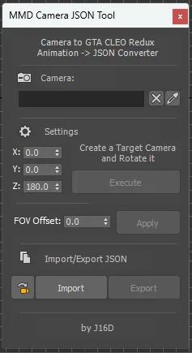
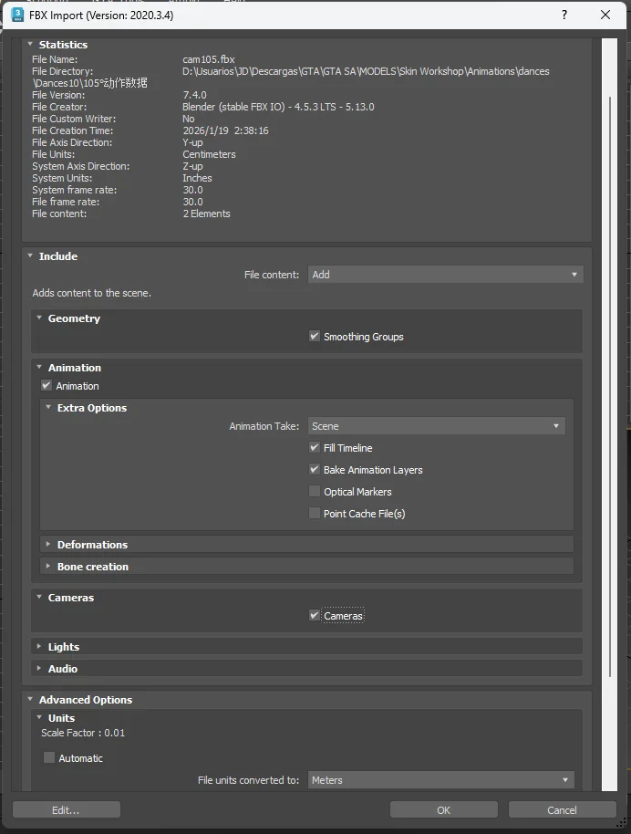

# MMD Camera JSON Tool



A 3ds Max tool to convert camera animations (MMD/Blender) to JSON format compatible with CLEO Redux Dance Loader for GTA San Andreas.

**Latest Version:** 5.5  
**Author:** J16D  
**Latest Update:** December 26, 2025

## 📋 Description

**MMD Camera JSON Tool** is a MaxScript utility that exports camera animations from 3ds Max to JSON files. These files are used by the **Dance Loader** in CLEO Redux for GTA San Andreas, enabling custom cinematics with dance animations.

The script streamlines the conversion process for cameras imported from Blender/MMD, applying necessary rotations and adjustments to work correctly in-game.

### Features

- Convert Free Camera animations to Target Camera
- Rotate camera animations (X, Y, Z axes)
- Apply FOV offset to all animation frames
- Export camera data to JSON format
- Import camera data from JSON files
- Support for Target Camera type with keyframe synchronization

## 🚀 Installation

1. Download the `ui_camera_gta_v5.4.ms` file
2. Copy the file to your 3ds Max scripts folder:
   ```
   C:\Program Files\Autodesk\3ds Max [version]\scripts\
   ```
3. In 3ds Max, go to: **Scripting > Run Script**
4. Select `ui_camera_gta_v5.4.ms` and execute it
5. The interface will appear as a floating window

## 🎮 Interface Overview

### Camera Section
- **Camera field**: Displays the currently selected camera
- **"P" Button (Pick)**: Select a **Target Camera** from the scene
- **"D" Button (Delete)**: Clear current selection
- **"F->T" Button**: Converts a Free Camera animation into a Target Camera

> **Note:** This tool works with **Target Camera** type only.

### Settings Section
Rotation controls to adjust camera orientation:
- **X:** Rotation around X-axis (0-360°)
- **Y:** Rotation around Y-axis (0-360°)
- **Z:** Rotation around Z-axis (default: 180°)
- **Execute Button**: Apply rotation to create and rotate the camera

The script creates a new Target Camera and applies the specified rotation to all keyframes in the animation.

### FOV Offset
- **FOV Offset spinner**: Add or subtract FOV values (-180 to +180)
- **Apply Button**: Apply the FOV offset to all animation frames

This is useful for adjusting the field of view across the entire camera animation.

### Import/Export JSON
- **Import Button**: Load camera animation from a JSON file
- **Export Button**: Save camera animation to a JSON file

The exported JSON file is compatible with the **Dance Loader** in **CLEO Redux** for GTA San Andreas.

## 📘 Tutorial

### Step-by-Step Workflow

1. **Import FBX from Blender**
   - Export your camera from Blender as FBX
   - In 3ds Max, import the FBX with these settings:
   
   
   
   - Make sure **Cameras** option is checked
   - Set **Animation Take** to **Scene**
   - Enable **Fill Timeline** and **Bake Animation Layers**

2. **Select Target Camera**
   - Click the **"P" (Pick)** button
   - Select your Target Camera in the viewport
   - The camera name will appear in the Camera field

3. **Rotate Camera**
   - Set Z rotation to **180.0** (default value)
   - Click **Execute** button
   - This flips the camera to match GTA SA coordinate system

4. **Adjust Camera Position**
   - Manually adjust the camera and its target to match the original position in Blender
   - Use the viewport to verify the framing

5. **Apply FOV Offset (Optional)**
   - If needed, add or subtract FOV using the **FOV Offset** spinner
   - Click **Apply** to update all keyframes

6. **Export JSON**
   - Click the **Export** button
   - Choose save location for your `.json` file
   - Done! You now have your camera ready for GTA SA

### Usage in GTA San Andreas

The exported JSON file can be used with:
- **CLEO Redux Dance Loader** by J16D
- Place the JSON file in the appropriate Dance Loader directory
- The camera animation will play during dance sequences in-game

## 🔧 Technical Details

### Camera Data Exported
- Position keyframes (X, Y, Z)
- Rotation keyframes
- FOV (Field of View) values
- Target position (for Target Cameras)
- Roll angle
- Frame timing information

### Coordinate System
The script handles coordinate system conversion between:
- Blender/MMD coordinate system
- 3ds Max coordinate system  
- GTA San Andreas coordinate system

The default Z=180° rotation compensates for the axis orientation differences.

## 📝 Requirements

- Made with Autodesk 3ds Max 2024
- Camera animation imported from Blender or MMD
- Target Camera type in 3ds Max

## ⚠️ Important Notes

- Always use **Target Camera** type for best results
- The script creates a new camera when using the Execute button
- Original camera will be hidden after rotation is applied
- Make sure to save your Max scene before exporting
- JSON files are compatible only with CLEO Redux Dance Loader

## 🐛 Troubleshooting

**Camera not appearing in the field:**
- Make sure you're selecting a Target Camera, not a Free Camera
- Use the F->T button to convert Free Cameras first

**Rotation not working correctly:**
- Verify the camera has keyframed animation
- Check that both camera and target have position keys

**Export button disabled:**
- Select a camera using the Pick button first
- Ensure the camera has animation data

## 📄 License

This tool is provided as-is for use with 3ds Max and GTA San Andreas modding.

## 🤝 Credits

**Created by:** J16D  
**For:** CLEO Redux Dance Loader - GTA San Andreas

---

**Latest Version:** 5.4 (December 26, 2025)  
**Fixed:** Camera rotations and coordinate system conversion
